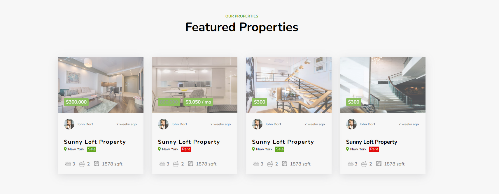

# MQ_BT_Shivam

# 👨‍💻 Shivam's Frontend Project Showcase – HTML/CSS UI Collection 🌐

Welcome to my personal frontend project folder!  
This repository contains a collection of my **HTML & CSS projects**, built with love 💖 to practice, learn, and grow as a frontend developer.

Each folder represents a **self-contained UI project** with its own `README.md`, preview, and clean code structure.

---

## 📁 Projects Included

### 🚀 Project 1: Responsive Column In Website

A clean, modern, and responsive **real estate listing UI** built using just HTML and CSS.  
Perfect for showcasing properties with pricing, tags (Sale/Rent), and agent details.

📸 **Preview:**

![Responsive Real Estate UI] 

🔗 **Project Folder:** [`Responsive-Column-In-Website`](./Responsive-Column-In-Website)

🔧 **Tech Stack:** HTML5, CSS3  
🎯 **Features:**
- Responsive grid with 4 property cards
- Sale/Rent price badges
- Location, icons, and sqft info
- Agent profile with avatar and time info

---

### 🔜 Project 2: *[Coming Soon]*  
🛠️ Planning a beautiful landing page using Flexbox or Grid!

---

## 👨‍🎓 About Me

Hi! I'm **Shivam (aka Shivu)** 👨‍💻  
A BCA student and passionate frontend + backend developer.

### 🔧 I Love Building:
- 🎨 Responsive UI designs using HTML/CSS
- ⚙️ Backend logic in Python & C++
- 🧠 Clean and reusable code structures
- 📚 Educational projects that solve real problems

### 🌐 Let’s Connect:
- GitHub: [Dev-Shivam-05](https://github.com/Dev-Shivam-05)
- Email: shivambhadoriya1605@gmail.com

---

## ⭐ Star & Support

If you like this collection or found it helpful,  
please consider giving it a **⭐ star** to show support!

It motivates me to keep learning and sharing more projects 🙌

---

> _“Great UIs aren’t built in a day — but line by line with passion.”_ – Shivu

Happy Coding! 💻🔥
